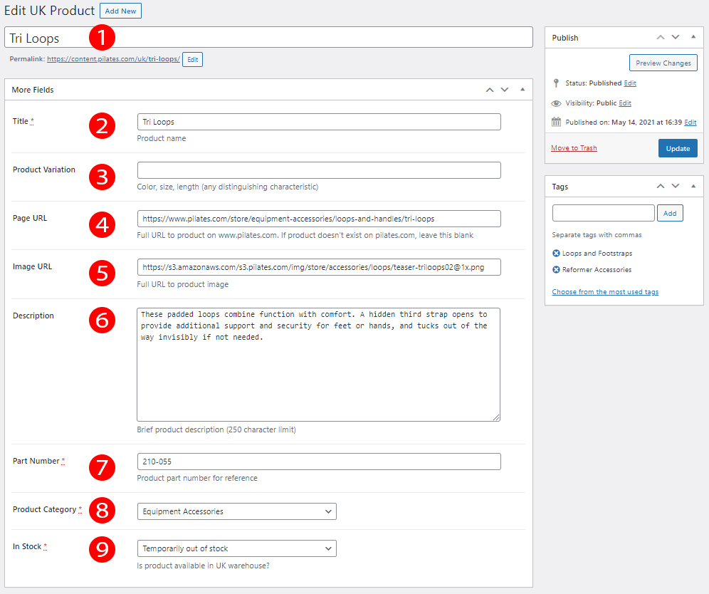

# UK Mirror Documentation

## How to use the mirror comparison tool:

#### Generate a CMS report from https://content.pilates.com/wp-admin/
1. Click "All Export" in the bottom of the sidebar
2. From the "Choose a post type..." dropdown, choose "UK Products"
3. Click "Customize Export File >"
4. At the bottom of the page, you'll see a dropdown that says "Load Template...". Choose "UK Export"
5. Click "Continue"
6. Click "Confirm & Run Export" 
7. Under "Click to Download", click "CSV"
8. Open that CSV file in Excel and save it as a .xlsx file

#### Generate a Datafreight report from http://157.231.89.66:8080/
1. Click "List Stock"
2. Click "Export" in the bottom right of the screen and choose "Excel 2007+ Workbook (*.xlsx)"

#### Load the reports into the tool
1. In the tool, load the CMS xlsx file in the top option and the Datafreight xlsx in the bottom - the report will be generated automatically

## How to read the mirror comparison tool:

1. The first section titled "Products that are out of stock" are products that are marked "In Stock" on CMS but are no longer represented in Datafreight. These products need to be marked out of stock in CMS.
2. The second section titled "Products that are not in CMS" are products that are represented in Datafreight but are not in CMS. These are either new products or products we should ignore.
3. The last section titled "Products that are back in stock" are products that are marked out of stock on CMS but are now represented in Datafreight. These products need to be marked in stock in CMS.

## Working in CMS:

In CMS (https://content.pilates.com/wp-admin/) we work almost entirely under "UK Products" in the sidebar. To add a new product click "Add New" at the top, or to edit a product search for the product number, title, etc, then click on the product to edit. They will both take you to this screen:

1. The Wordpress product title. This will only be shown in the CMS.
2. Product title that will be shown on the live site. Keep the title as short as possible and put any variations in the next field.
3. Product variation like color, size, length, or other distinguishing characteristic.
4. The URL of this product on pilates.com.
5. The image URL of this product on pilates.com. To find this (in Firefox or Chrome browser) right click the image and click "Inspect". You will see a highlighted section of code in the window that opens. Copy the full filepath within `src=" "`.
6. Description of the product. Keep it brief!
7. Part number of this product.
8. Pick a product category.
9. In stock, temporarily out of stock, or permanently out of stock.

Once updated or published, the product changes will be automatically reflected on the live site.